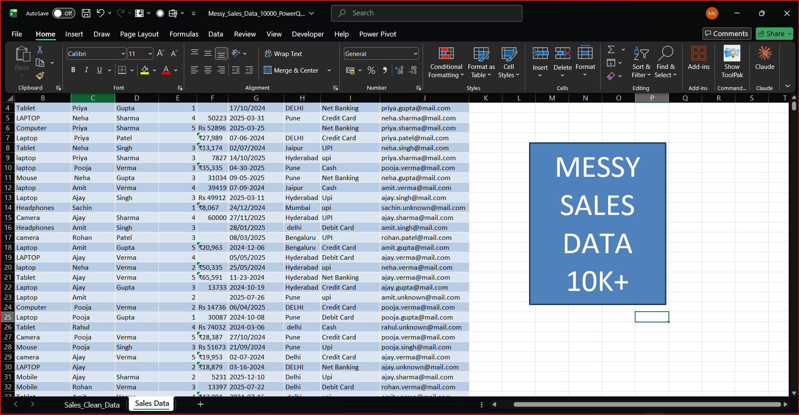
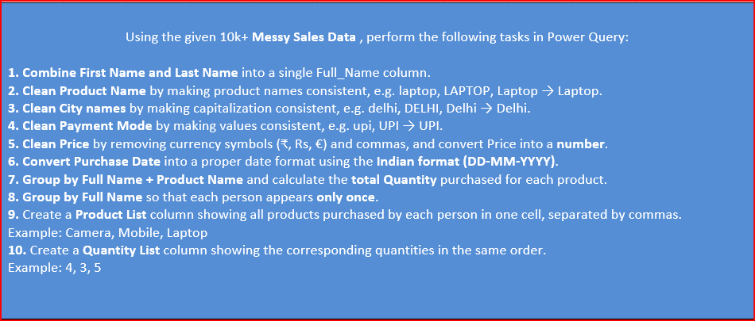
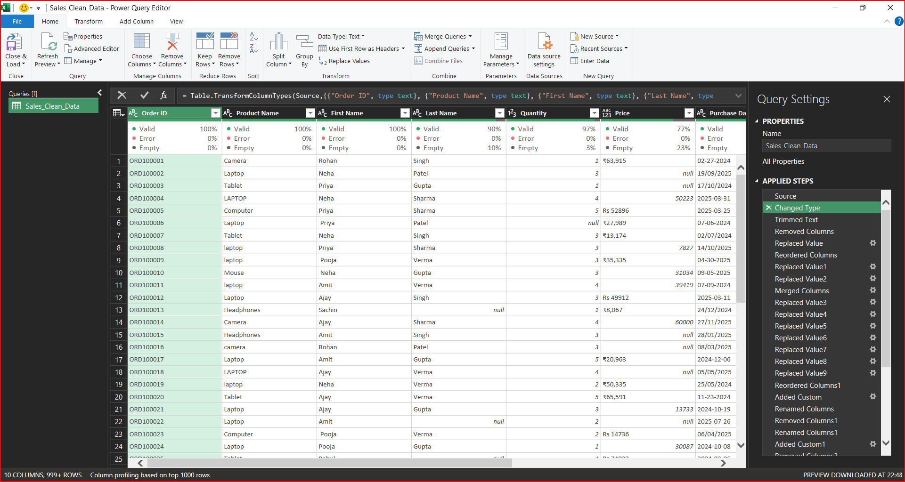
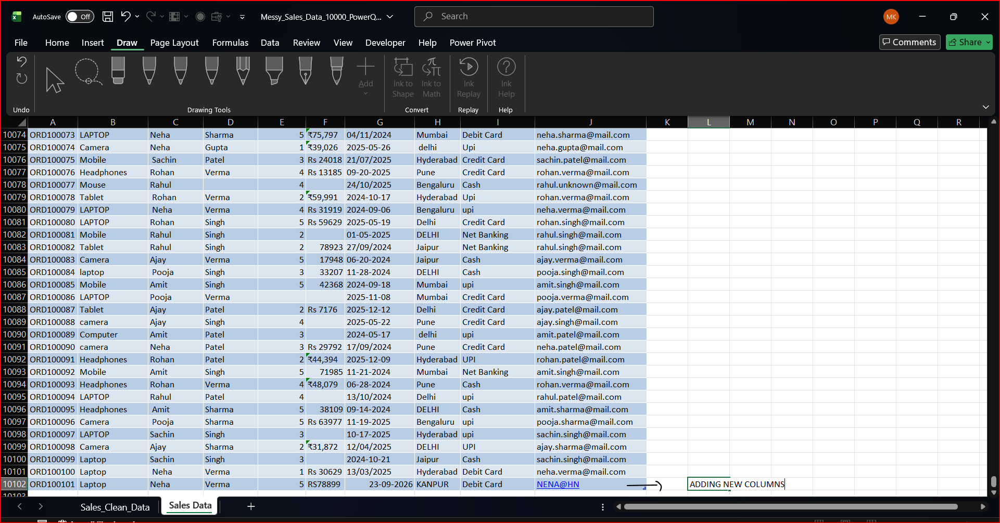
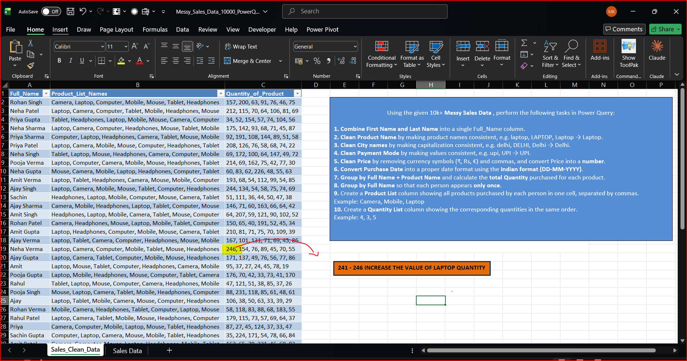
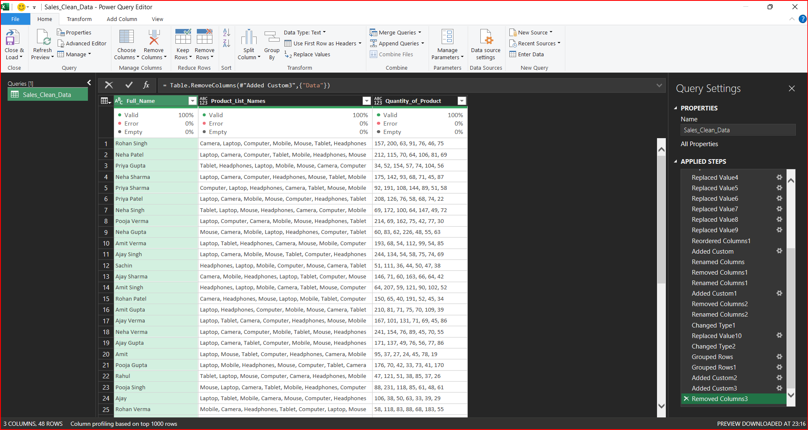
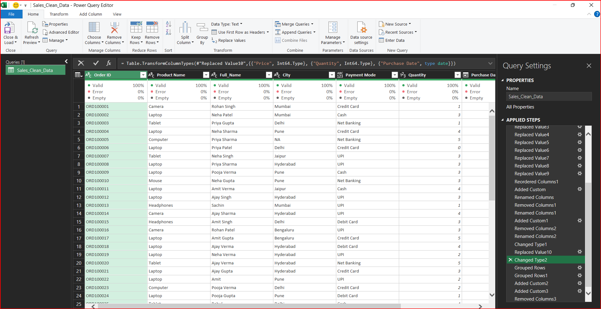
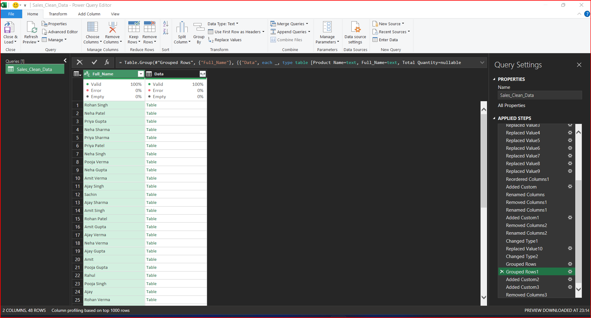
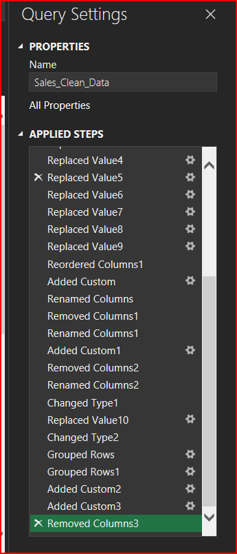
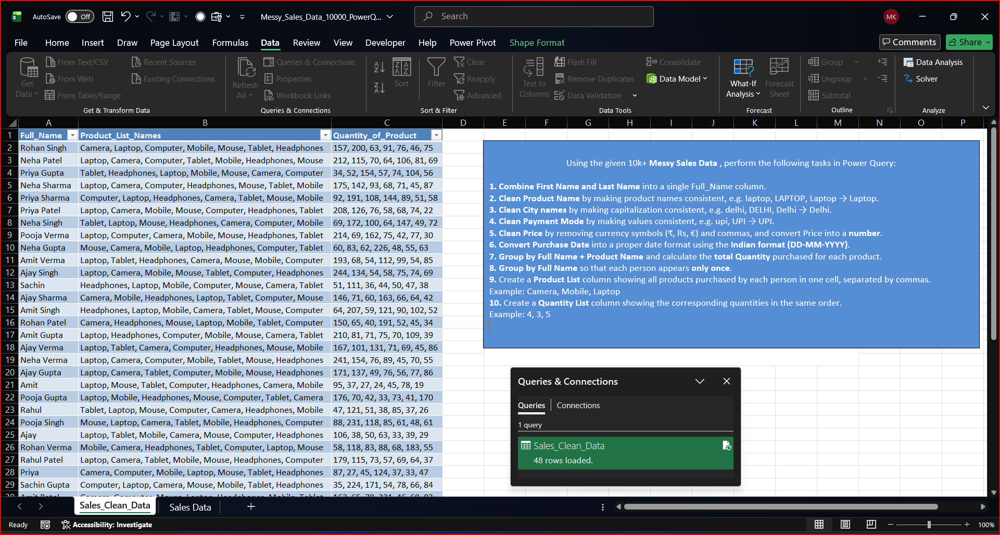

# 📊 Power Query Sales Data Cleaning & Transformation

## 📌 Project Overview

This project demonstrates a complete **Sales Data Cleaning and Transformation workflow using Microsoft Excel Power Query**.

The dataset contains **10,000+ sales records** with various real-world data-quality issues such as inconsistent product names, customer names, prices, dates, cities, and payment modes.

The main objective of this project was to transform the messy raw sales data into a **clean, standardized, structured, and analysis-ready dataset** using Power Query.

---

## 🎯 Project Objectives

The major objectives of this project were:

- Clean and standardize 10,000+ sales records
- Identify and handle inconsistent data
- Merge First Name and Last Name
- Create a Full Name column
- Standardize Product Names
- Standardize City names
- Standardize Payment Modes
- Clean Price values
- Remove currency symbols and unnecessary characters
- Convert Price into numeric format
- Handle different Purchase Date formats
- Convert Purchase Date into proper date format
- Group data by Customer and Product
- Calculate Total Quantity
- Remove duplicate Customer-Product combinations
- Create Product Lists for each customer
- Create corresponding Quantity Lists
- Create a final customer-level summary

---

# 📂 Dataset

The original dataset contains **10,000+ sales transactions**.

### Main Columns

| Column | Description |
|---|---|
| Order ID | Unique order identifier |
| Product Name | Name of the purchased product |
| First Name | Customer's first name |
| Last Name | Customer's last name |
| Quantity | Quantity purchased |
| Price | Product price |
| Purchase Date | Date of purchase |
| City | Customer city |
| Payment Mode | Method of payment |
| Email | Customer email |

---

# 🖼️ 1. Raw Sales Data

The project starts with a raw sales dataset containing more than 10,000 records.



The dataset intentionally contains inconsistent values so that different Power Query data-cleaning and transformation techniques can be applied.

---

# 📝 2. Power Query Tasks

The following tasks were performed using Microsoft Excel Power Query.



### Tasks Performed

1. Data profiling
2. Text cleaning
3. Text standardization
4. Merge First Name and Last Name
5. Product Name standardization
6. City standardization
7. Payment Mode standardization
8. Price cleaning
9. Date cleaning
10. Data type conversion
11. Group Customer + Product
12. Calculate Total Quantity
13. Remove duplicate combinations
14. Group data by customer
15. Create Product List
16. Create Quantity List
17. Generate final customer-level summary

---

# 🧹 3. Before Data Cleaning

The original dataset contained several inconsistencies.



### Examples of Data Quality Issues

#### Product Name

The same product appeared in different formats:

```text
Laptop
laptop
LAPTOP
````

These values represent the same product but have inconsistent capitalization.

#### City

```text
Delhi
delhi
DELHI
```

#### Payment Mode

```text
UPI
upi
```

#### Price

The Price column contained values such as:

```text
₹63,915
Rs 52896
₹27,989
50223
€8,067
```

#### Purchase Date

The Purchase Date column contained multiple formats:

```text
02-27-2024
19/09/2025
2025-03-31
06/04/2025
```

These inconsistencies needed to be resolved before analysis.

---

# 👤 4. Creating Full Name

The original dataset contained two separate columns:

```text
First Name
Last Name
```

For example:

```text
Rohan | Singh
```

These columns were merged to create:

```text
Rohan Singh
```



### Why Create Full Name?

Creating a single `Full_Name` column makes customer-level grouping and analysis easier.

It also allows us to group all transactions belonging to the same customer.

---

# ➕ 5. Results After Adding New Columns

After creating the required custom columns and performing initial transformations, the dataset contains additional cleaned information.



These columns were later used for:

* Grouping
* Aggregation
* Customer analysis
* Product analysis
* Quantity calculation

---

# 🧼 6. Data Cleaning Using Power Query

Power Query was used to clean and standardize the dataset.



### Cleaning Operations

The following transformations were performed:

* Trimmed unnecessary spaces
* Standardized text values
* Replaced inconsistent values
* Standardized Product Name
* Standardized City
* Standardized Payment Mode
* Removed currency symbols
* Removed commas from Price
* Converted Price into numeric format
* Converted Purchase Date into date format
* Removed unnecessary columns
* Renamed columns
* Created custom columns

The major benefit of Power Query is that the entire process is **repeatable and refreshable**.

---

# 💰 7. Price Cleaning

The Price column contained different formats.

### Example

```text
₹63,915
Rs 52896
₹27,989
50223
```

These values were cleaned by removing unwanted currency symbols and separators.

### Example Transformation

```text
₹63,915 → 63915
Rs 52896 → 52896
₹27,989 → 27989
```

After cleaning, the Price column was converted into a numeric data type.

This allows the dataset to be used for:

* Total Sales
* Average Price
* Minimum Price
* Maximum Price
* Revenue Analysis

---

# 📅 8. Purchase Date Cleaning

The Purchase Date column contained multiple date formats.

### Examples

```text
02-27-2024
19/09/2025
2025-03-31
06/04/2025
```

These values were converted into a proper date data type.

The final date format required for the project was:

```text
DD-MM-YYYY
```

For example:

```text
31-03-2025
19-09-2025
06-04-2025
```

This allows the dataset to be used for:

* Year analysis
* Month analysis
* Quarter analysis
* Date filtering
* Sales trends

---

# 🔢 9. Before Grouping

Before grouping, the same customer and product could appear multiple times because a customer may have purchased the same product in multiple transactions.



### Example

| Full Name   | Product Name | Quantity |
| ----------- | ------------ | -------: |
| Rohan Singh | Camera       |        1 |
| Rohan Singh | Camera       |        3 |
| Rohan Singh | Mobile       |        2 |
| Rohan Singh | Mobile       |        1 |

The objective was to combine these repeated Customer-Product combinations.

---

# 📊 10. Grouping Customer + Product

The data was grouped using:

```text
Full_Name
+
Product Name
```

The Quantity column was aggregated using **SUM**.



### Example

Before grouping:

| Customer    | Product | Quantity |
| ----------- | ------- | -------: |
| Rohan Singh | Camera  |        1 |
| Rohan Singh | Camera  |        3 |
| Rohan Singh | Mobile  |        2 |
| Rohan Singh | Mobile  |        1 |

After grouping:

| Customer    | Product | Total Quantity |
| ----------- | ------- | -------------: |
| Rohan Singh | Camera  |              4 |
| Rohan Singh | Mobile  |              3 |

Therefore:

```text
Camera → 1 + 3 = 4
Mobile → 2 + 1 = 3
```

This creates a unique Customer + Product combination while preserving the total quantity.

---

# 🧮 11. Creating Product List

After grouping the data by customer, a Product List was created using Power Query M.

### M Code

```powerquery
Text.Combine(
    List.Transform(
        [Data][Product Name],
        each Text.From(_)
    ),
    ", "
)
```

### Result

Instead of having multiple rows:

```text
Rohan Singh | Camera
Rohan Singh | Mobile
Rohan Singh | Laptop
```

the final Product List becomes:

```text
Rohan Singh | Camera, Mobile, Laptop
```

---

# 🔢 12. Creating Quantity List

A corresponding Quantity List was created using Power Query M.

### M Code

```powerquery
Text.Combine(
    List.Transform(
        [Data][Total Quantity],
        each Text.From(_)
    ),
    ", "
)
```

### Result

```text
Customer:
Rohan Singh

Products:
Camera, Mobile, Laptop

Quantity:
4, 3, 5
```

The values correspond position-wise:

```text
Camera → 4
Mobile → 3
Laptop → 5
```

---

# 👤 13. Final Customer-Level Summary

The main requirement of the transformation was:

> **The customer name should not repeat.**

Instead of:

```text
Rohan Singh | Camera | 4
Rohan Singh | Mobile | 3
Rohan Singh | Laptop | 5
```

the final output becomes:

```text
Rohan Singh | Camera, Mobile, Laptop | 4, 3, 5
```

This provides a single row for each customer.

---

# 🔍 14. Power Query Applied Steps

The complete transformation process can be viewed in the Power Query Applied Steps panel.



### Transformation Flow

```text
Source
   ↓
Changed Type
   ↓
Trimmed Text
   ↓
Removed Columns
   ↓
Replaced Values
   ↓
Merged Columns
   ↓
Reordered Columns
   ↓
Added Custom Columns
   ↓
Changed Data Types
   ↓
Grouped Rows
   ↓
Product List
   ↓
Quantity List
   ↓
Final Customer Summary
```

Every transformation is stored as an Applied Step, making the workflow easy to audit and reproduce.

---

# 📋 15. Final Clean Dataset

After completing all Power Query transformations, the final dataset becomes clean, standardized, and ready for analysis.



### Final Output Example

| Full Name   | Product List           | Quantity |
| ----------- | ---------------------- | -------- |
| Rohan Singh | Camera, Mobile, Laptop | 4, 3, 5  |
| Neha Patel  | Laptop, Camera, Tablet | 7, 2, 5  |
| Priya Gupta | Tablet, Computer       | 5, 2     |

### Final Requirement Achieved

**One Customer → Multiple Products → Corresponding Quantities**

Example:

```text
Rohan Singh
Camera, Mobile, Laptop
4, 3, 5
```

---

# 🧠 16. Power Query M Functions Used

## `Text.Combine`

Combines multiple text values into a single text string.

```powerquery
Text.Combine(List, ", ")
```

## `List.Transform`

Transforms every value inside a list.

```powerquery
List.Transform(
    [Data][Product Name],
    each Text.From(_)
)
```

## `Text.From`

Converts a value into text.

```powerquery
Text.From(_)
```

## `Table.Group`

Groups rows and performs aggregation.

```powerquery
Table.Group(
    Source,
    {"Full_Name", "Product Name"},
    {
        {
            "Total Quantity",
            each List.Sum([Quantity]),
            Int64.Type
        }
    }
)
```

---

# 🛠️ 17. Tools & Technologies

### Tools Used

* Microsoft Excel
* Power Query
* Power Query M

### Skills Demonstrated

* Data Cleaning
* Data Transformation
* Data Standardization
* Data Profiling
* Group By
* Aggregation
* Custom Columns
* Text Transformation
* List Transformation
* Date Transformation
* Numeric Transformation
* Data Type Conversion
* Duplicate Handling

---

# 📁 18. Repository Structure

```text
Power-Query-Sales-Data/
│
├── Images/
│   ├── 01_RAW_SALES_DATA.png
│   ├── 02_ADDING_NEW_COLUMN.png
│   ├── 03_AFTER_ADD_NEW_COLUMNS.png
│   ├── 04_AFTER_CLEANING_DATA.png
│   ├── 05_AFTER_GROUPING_DATA.png
│   ├── 06_BEFORE_CLEANING_DATA.png
│   ├── 07_BEFORE_GROUPING_DATA.png
│   ├── 08_QUERY_PERFORMED.png
│   ├── 09_FINAL_CLEAN_DATA.png
│   └── 10_TASKS.png
│
├── Messy_Sales_Data_10000_PowerQuery.xlsx
│
└── README.md
```

---

# 📈 19. Business Applications

The cleaned dataset can be used for several types of business analysis.

### Customer Analysis

* Products purchased by each customer
* Total quantity purchased
* Repeat product purchases
* Customer purchase patterns

### Product Analysis

* Most purchased products
* Product quantity analysis
* Product popularity
* Customer-product relationships

### Sales Analysis

* Revenue analysis
* Monthly sales trends
* City-wise sales
* Payment mode analysis
* Product-wise sales

---

# 🚀 20. Future Improvements

This project can be extended into a complete Sales Analytics solution using:

* Excel Dashboard
* Pivot Tables
* Pivot Charts
* Slicers
* Power BI
* SQL
* Customer Segmentation
* Product Performance Analysis
* Revenue Analysis
* Sales Trend Analysis

---

# ⭐ 21. Project Summary

```text
10,000+ Raw Sales Records
          ↓
      Data Profiling
          ↓
      Data Cleaning
          ↓
 Text Standardization
          ↓
    Full Name Creation
          ↓
    Price Cleaning
          ↓
    Date Cleaning
          ↓
Customer + Product Grouping
          ↓
   Quantity Aggregation
          ↓
    Duplicate Handling
          ↓
   Product List Creation
          ↓
   Quantity List Creation
          ↓
Final Customer-Level Summary
```

### Final Result

```text
Customer
    ↓
Multiple Products
    ↓
Corresponding Quantities
```

Example:

```text
Rohan Singh
Camera, Mobile, Laptop
4, 3, 5
```

---


## ⭐ Key Takeaway

> **10,000+ messy sales records were transformed into a clean, structured, customer-level dataset using Microsoft Excel Power Query.**

````

